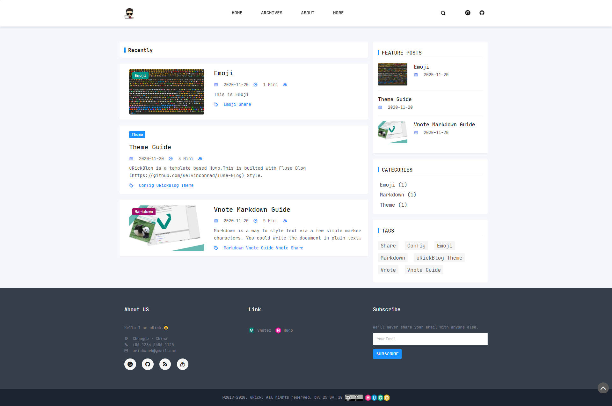

# hugo-theme-uRickBlog
uRickBlog is a template based  Hugo,This is builted with [Fuse-Blog](https://github.com/kelvinconrad/fuse-Blog) Style.

# Config 
See example

# Hugo Version
At least v0.79.0/extended 

Hugo： [https://github.com/gohugoio/hugo/releases](https://github.com/gohugoio/hugo/releases)

# Features
1. Responsive card layout
2. Search
3. i18n
4. RSS
5. Blog gallery
6. Code highlighting
7. Sitemap
8. Pagination
9. Multi-level menu
10. GoogleAnalytics/GoogleTagManager/GoogleAdsense/BaiduAnalytics
11. comments[disqus, utterances,gitalk]
12. Custom style

# Screenshot

