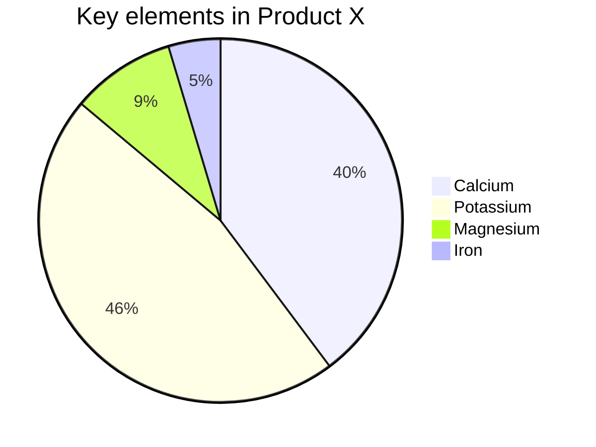

# 1. Vnote


>  一款开源更懂程序员、简单易用、轻量级的Markdown笔记，集成笔记管理、UML、流程图、MathJax、Graphviz、FlowchartJS、Mermaid一体的强大的笔记软件工具[^1]，当然社区也有很多支持Makrdown的笔记工具，笔者也是几经折腾后偶遇Vnote，觉得Vnote更强大易用些，至少目前没遇到比它更好的。


## 1.1. 支持的功能
- 支持Markdown语法所有功能，并且支持个性化的渲染器；
- 支持Vim编辑模式，快速提升编辑带来的快感；
- 支持强大全文匹配搜索功能，不担心找不到被遗忘角落的笔记；
- 支持Mermaid、 Flowchart.js、 MathJax、 PlantUML 和 Graphviz；
- 支持多种格式md/pdf/html文件导出以及主题个性化定义，每个人都可以肆意玩弄个性的笔记；
- 支持多图床：Github、Gitee、微信、腾讯云。

*当然Vnote的功能不仅仅只有这些，更多功能请亲自[下载](https://github.com/tamlok/vnote/releases)体验会更不错*

## 1.2. Markdown概述
> 既然使用[Vnote](https://github.com/tamlok/vnote)那边需要了解[Markdown](https://zh.wikipedia.org/wiki/Markdown)是什么东西；它其实是由John Gruber创建的一种轻量级的标记语言，就如我们常见HTML/XHTML标记语言一样，它更简洁跟简单，没有过多复杂的语法规范，只需要了解几个常见的标记语法即可上手。Markdown目前用于最广泛的就是写作，因为它及其简洁、写作不用过多的关注内容排版、字体格式而备受青睐。当然它也有缺点，就是对普通群体不是更友好，一些高级功能体验的欠缺，如表格管理、图片管理、图片等等，那么[Vnote](https://github.com/tamlok/vnote)就解决这些短板，甚至更加强大，体验更友好。

## 1.3. 基础语法引导
> 对[Vnote](https://github.com/tamlok/vnote)和[Markdown](https://zh.wikipedia.org/wiki/Markdown)有一个简单了解后，下面介绍一下常见的语法规范[^2]。


### 1.3.1. 标题
标题使用`#`符号加空格开头，示例如下：

```md
# This is an H1

## This is an H2

###### This is an H6
```

### 1.3.2. 块引用
块引用使用`>`符号加空格开头，示例如下：

```md
> This is a blockquote with two paragraphs. This is first paragraph.
> This is second pragraph. Vestibulum enim wisi, viverra nec, fringilla in, laoreet vitae, risus.
> This is another blockquote with one paragraph. There is three empty line to seperate two blockquote.
```

*示例：*

> This is a blockquote with two paragraphs. This is first paragraph.
> This is second pragraph. Vestibulum enim wisi, viverra nec, fringilla in, laoreet vitae, risus.
> This is another blockquote with one paragraph. There is three empty line to seperate two blockquote.


### 1.3.3. 列表
有序列表使用阿利伯数字标识加`.`加空格开头，其中序号不是必须有序的，序号只作为一个标识而已；而无序列表则使用`-`或`*`加空格标识，任务列表则使用`[]`与'[x]'加空格标识，后者标识已完成任务，但是它必须搭配无序列表与有序列表一起使用。示例如下：

```md
1. Item One
2. Item Two
2. Item Three 

* Item 1
* Item 2

- Item 1
- Item 2

- [ ] a task list One
- [ ] a task list Two
- [x] completed
```

*示例：*

1. Item One
2. Item Two
2. Item Three 

* Item 1
* Item 2

- Item 1
- Item 2

- [ ] a task list One
- [ ] a task list Two
- [x] completed

1. [ ] a task list One
2. [ ] a task list Two
3. [x] completed

### 1.3.4. 斜体与加粗
加粗与斜体常用编辑样色的应用，斜体使用“*”与“_”包裹，粗体使用“**”与“__”包括。

```md
*Italic*
_Italic_

**Bold**
__Bold__
```

*示例：*

  *Italic*
  _Italic_

  **Bold**
  __Bold__


### 1.3.5. 删除线与下划线
```md
 ~~Mistaken text.~~
  <u>Underline.</u>
```

 ~~Mistaken text.~~
  <u>Underline</u>

### 1.3.6. 表格
在表格中，也可以其他MD格式的样式，若需要定义表格文本位置，使用“:”表示，通常文本默认居中显示，示例如下：

```md
| col 1 | col 2 | col 3 |
| :---- | ----- | ----: |
| cell1 | **cell2** | cell3 |
| cell4 | cell5 | cell6 |
```


| col 1 |   col 2    | col 3 |
| :---- | ---------- | ----: |
| cell1 | **cell2** | cell3 |
| cell4 | cell5      | cell6 |

### 1.3.7. 图片和链接
> MD支持两种样式的超链接，一种是可以定义“titile”属性的连接，一种是无“titile"属性的连接.
> 同理图片连接引入也如此

```md
This is [uRick`s Blog][https://urick.gitee.io/blog/ "MyBlog") inline link.
[uRick`s Blog](https://urick.gitee.io/blog/) has no title attribute.


```

This is [uRick Blog](https://urick.gitee.io/blog/ "MyBlog") inline link.
[uRick Blog](https://urick.gitee.io/blog/) has no title attribute.


### 1.4.6. 脚注
```md
This is a footnote [^1].

[^1]: Here is the detail of the footnote.
```

### 1.4.7. 上标和下标
> 需要在`Markdown`菜单中启用上标和下标并使用`Markdown-it`渲染引擎。

```md
This is the 1^st^ superscript.

This is the H~2~O subscript.
```

This is the 1^st^ superscript.

This is the H~2~O subscript.

## 1.4. 三方集成

### 1.4.1. 图表
> Vnote支持[Flowchart.js](http://flowchart.js.org/  "flow")/[Mermaid](https://mermaidjs.github.io/ "Mermaid")/[WaveDrom](https://wavedrom.com/ "WaveDrom")，需要在`Markdown`菜单中开启，并重写打开对应的笔记才能渲染对应的样式

1. flowchart示例

        ```flowchart
        st=>start: Start:>http://www.google.com[blank]
        e=>end:>http://www.google.com
        op1=>operation: My Operation
        sub1=>subroutine: My Subroutine
        cond=>condition: Yes
        or No?:>http://www.google.com
        io=>inputoutput: catch something...
    
        st->op1->cond
        cond(yes)->io->e
        cond(no)->sub1(right)->op1
        ```

```md
st=>start: Start:>http://www.google.com[blank]
e=>end:>http://www.google.com
op1=>operation: My Operation
sub1=>subroutine: My Subroutine
cond=>condition: Yes
or No?:>http://www.google.com
io=>inputoutput: catch something...

st->op1->cond
cond(yes)->io->e
cond(no)->sub1(right)->op1
```


2. mermaid 示例

        ```mermaid {linenos=table,hl_lines=[8,"15-17"],linenostart=199}
        sequenceDiagram
            Alice ->> Bob: Hello Bob, how are you?
            Bob-->>John: How about you John?
            Bob--x Alice: I am good thanks!
            Bob-x John: I am good thanks!
            Note right of John: Bob thinks a long<br/>long time, so long<br/>that the text does<br/>not fit on a row.
    
            Bob-->Alice: Checking with John...
            Alice->John: Yes... John, how are you?
        ```

```
sequenceDiagram
    Alice->>Bob: Hello Bob, how are you?
    alt is sick
        Bob->>Alice: Not so good :(
    else is well
        Bob->>Alice: Feeling fresh like a daisy
    end
    opt Extra response
        Bob->>Alice: Thanks for asking
    end
```

        ```mermaid
        pie
            title Key elements in Product X
            "Calcium" : 42.96
            "Potassium" : 50.05
            "Magnesium" : 10.01
            "Iron" :  5
        ```



        ```wavedrom
        { signal: [
          {    name: 'clk',   wave: 'p..Pp..P'},
          ['Master',
            ['ctrl',
              {name: 'write', wave: '01.0....'},
              {name: 'read',  wave: '0...1..0'}
            ],
            {  name: 'addr',  wave: 'x3.x4..x', data: 'A1 A2'},
            {  name: 'wdata', wave: 'x3.x....', data: 'D1'   },
          ],
          {},
          ['Slave',
            ['ctrl',
              {name: 'ack',   wave: 'x01x0.1x'},
            ],
            {  name: 'rdata', wave: 'x.....4x', data: 'Q2'},
          ]
        ]}
        ```


### 1.4.1.1. UML
> UML是基于开源项目[PlantUML](http://plantuml.com/ "titile")实现,使用方式如下，需要在代码块中标明使用语言`puml` ；当然它不只是可以绘制UML图，他还支持甘特图、思维导图、架构图等等，可以参考官方实例实现。

        ```puml
        @startmindmap
        * Debian
        ** Ubuntu
        *** Linux Mint
        *** Kubuntu
        *** Lubuntu
        *** KDE Neon
        ** LMDE
        ** SolydXK
        ** SteamOS
        ** Raspbian with a very long name
        *** <s>Raspmbc</s> => OSMC
        *** <s>Raspyfi</s> => Volumio
        @endmindmap
        ```


        ```puml
        @startuml
        Class21 #-- Class22
        Class23 x-- Class24
        Class25 }-- Class26
        Class27 +-- Class28
        Class29 ^-- Class30
        @enduml
        ```


### 1.4.1.2. Graphviz
> VNote集成[Graphviz](http://www.graphviz.org/) 来绘制图表，不过默认未启用，需要在设置`Markdown`选项中启用即可，使用方法如下：
> 当然PlantUML也是支持[Graphviz](http://www.graphviz.org/) 语法的。

        ```puml
        @startdot
        digraph foo {
          node [style=rounded]
          node1 [shape=box]
          node2 [fillcolor=yellow, style="rounded,filled", shape=diamond]
          node3 [shape=record, label="{ a | b | c }"]
    
          node1 -> node2 -> node3
        }
        @enddot
        ```


### 1.4.2. 数学公式
> Vnote集成 [MathJax](https://www.mathjax.org/) 实现支持数据公式，默认的**块公式**的分隔符是`$$...$$`，**行内公式**的分隔符是`$...$`，实例如下：


```md
$$ \int_{a}^{b} x^2 dx $$
```

$$ \int_{a}^{b} x^2 dx $$

```md
$$
\mathbf{V}_1 \times \mathbf{V}_2 = \begin{vmatrix}
\mathbf{i} & \mathbf{j} & \mathbf{k} \\
\frac{\partial X}{\partial u} &  \frac{\partial Y}{\partial u} & 0 \\
\frac{\partial X}{\partial v} &  \frac{\partial Y}{\partial v} & 0 \\
\end{vmatrix}
$$
```
*示例：*


### 1.4.8. 提示信息
> Vnote特有的语义提示代码片段，通常用于标记笔记，是一个很不错的工具。

```md
::: alert-info
alert-info Text
:::

::: alert-danger
alert-danger Text
:::

::: alert-primary
alert-primary Text
:::

::: alert-secondary
alert-secondary Text
:::

::: alert-successs
alert-successs Text
:::

::: alert-info
alert-info Text
:::

::: alert-warning
 alert-warning Text
:::

::: alert-danger
alert-danger Text
:::

::: alert-light
alert-light Text
:::

::: alert-dark
alert-dark Text
:::
```


[^1]:参考[https://tamlok.github.io/vnote/zh_cn/#!index.md](https://tamlok.github.io/vnote/zh_cn/#!index.md).
[^2]:参考[Mastering Markdown](https://guides.github.com/features/mastering-markdown/).
